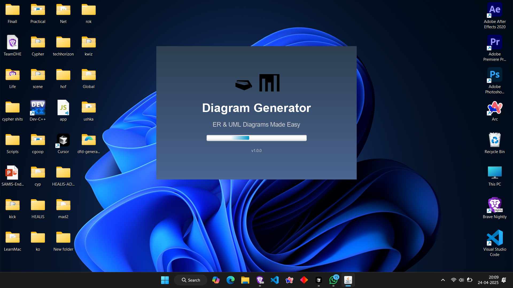

# FlowSnap: Advanced Diagram Generator

> **FlowSnap** is a powerful, intuitive visualization tool that transforms complex database schemas and system designs into interactive, visually appealing diagrams. Designed for architects, developers, and analysts, this tool bridges the gap between technical structures and clear visual representations.



## Features Overview

FlowSnap provides comprehensive support for multiple diagram types:

### Main Menu


### Entity-Relationship Diagrams


- **SQL to ER Diagram Conversion**: Parse SQL CREATE TABLE statements and automatically generate ER diagrams
- **Interactive Canvas**: Drag entities to rearrange the diagram for better visualization
- **Relationship Visualization**: Automatic detection and display of relationships with proper cardinality
- **Primary and Foreign Key Highlighting**: Clear visual distinction between key types

### UML Class Diagrams


- **Class Modeling**: Visualize classes, attributes, methods, and relationships
- **Inheritance Representation**: Clear display of class hierarchies and inheritance patterns
- **Relationship Types**: Support for associations, aggregations, compositions, and dependencies

### Data Flow Diagrams


- **Process Visualization**: Identify and visualize key processes in your system
- **Data Stores**: Show where data is stored throughout your application
- **Data Flow Paths**: Illustrate how data travels between processes and storage
- **Multiple Levels**: Create hierarchical DFDs to show increasing detail
- **External Entities**: Clearly mark system boundaries and external actors

## Project Structure


## Common Features

- **Zoom and Pan**: Easily navigate large diagrams with zoom in/out and panning functionality
- **Auto Layout**: Automatically arrange elements for optimal visualization
- **Export as Image**: Save your diagrams as PNG image files
- **Example Templates**: Use provided examples to see how the application works

## Requirements

- Java 11 or higher
- JavaFX (included with the Maven build)
- Minimum 4GB RAM recommended (8GB for large schemas)
- 100MB free disk space
- Graphics card supporting OpenGL 2.0 or higher
- 1280x720 minimum screen resolution (1920x1080 recommended)

## Installation and Running

### System Compatibility
- Windows 10/11 (64-bit)
- macOS 10.14+ (Mojave or newer)
- Linux with GTK3 (Ubuntu 18.04+, Fedora 30+)

### Using Maven

1. Clone the repository:
```
git clone https://github.com/AsPxD/FlowSnap.git
cd FlowSnap
```

2. Build the project:
```
mvn clean package
```

3. Run the application:
```
mvn javafx:run
```

### Using the JAR file

1. Download the latest JAR file from the releases page
2. Ensure Java 11+ is installed and in your PATH
3. Run the application:
```
java -jar flowsnap-1.0-SNAPSHOT.jar
```

### Installation Troubleshooting
- **JavaFX Missing**: If you encounter "Error: JavaFX runtime components are missing", download JavaFX SDK separately and add to module path
- **Graphics Issues**: Update your graphics drivers if diagrams appear distorted
- **Permission Errors**: On Linux/macOS, ensure execute permissions with `chmod +x flowsnap-1.0-SNAPSHOT.jar`

## Usage Guide

### ER Diagram Creation
1. Enter SQL CREATE TABLE statements in the text area on the left side
   - Include PRIMARY KEY and FOREIGN KEY constraints to properly visualize relationships
   - Each CREATE TABLE statement should end with a semicolon (;)
2. Click the "Generate ER Diagram" button to create the diagram
3. Use the interactive tools to refine your visualization

### UML Diagram Creation
1. Enter Java class definitions or use the visual editor to create classes
2. Define relationships between classes using the relationship toolbar
3. Customize visibility, methods, and attributes for each class

### DFD Creation
1. Use the toolbox to add DFD elements:
   - Processes (circles/rounded rectangles)
   - Data stores (open-ended rectangles)
   - External entities (squares)
   - Data flows (arrows)
2. Label each element by selecting it and editing properties
3. Create connections by selecting source and target elements

## Contributing

Contributions are welcome! Please feel free to submit a Pull Request.

## License

This project is licensed under the MIT License - see the LICENSE file for details. 